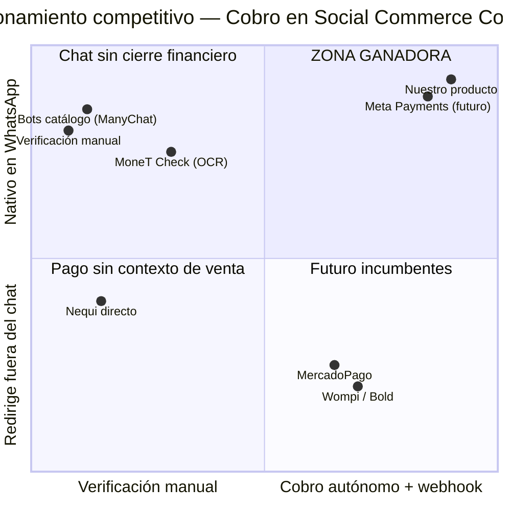
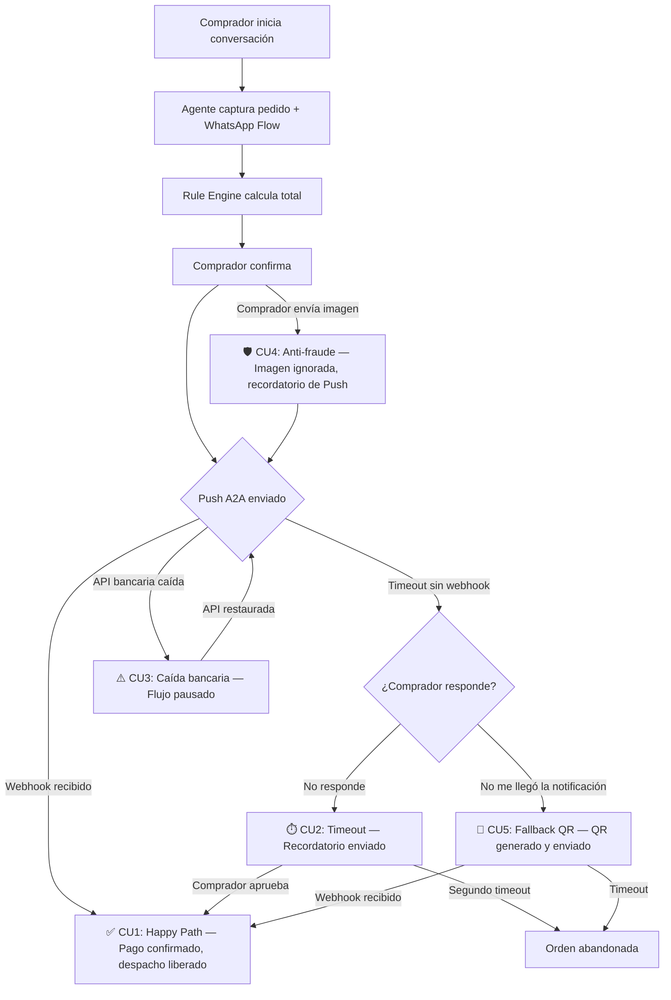
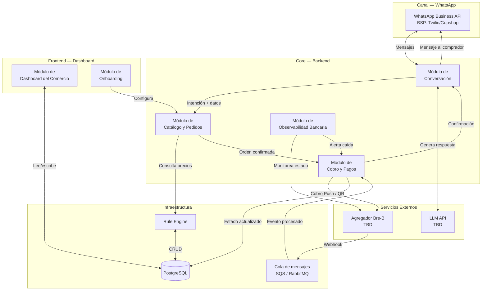

# PRD — Agente de Cierre y Recaudo Automático en WhatsApp
**Versión:** 1.0 | **Fecha:** Marzo 2026 | **Industria:** Agentic Commerce / Embedded Fintech
**Autor:** Bryan García + Claude (Head of Product + AI/Agent Architect)

> Este PRD fue construido segmento por segmento en co-creación iterativa. Cada sección fue aprobada individualmente antes de avanzar. Las decisiones de producto están documentadas con sus trade-offs y fuentes.

---

## Tabla de Contenidos

1. [One-Liner del Producto + JTBD](#1-one-liner-del-producto--jtbd)
2. [Contexto y Problema](#2-contexto-y-problema)
3. [ICP Detallado](#3-icp-detallado)
4. [Propuesta de Valor Única (UVP) y Diferenciadores](#4-propuesta-de-valor-única-uvp-y-diferenciadores)
5. [Casos de Uso Top 5](#5-casos-de-uso-top-5)
6. [Principios de Diseño No Negociables](#6-principios-de-diseño-no-negociables)
7. [User Journeys](#7-user-journeys)
8. [MVP Scope (MoSCoW)](#8-mvp-scope-moscow)
9. [Especificación Funcional: Módulos y Features](#9-especificación-funcional-módulos-y-features)
10. [Métricas de Éxito](#10-métricas-de-éxito)
11. [Plan de Evaluación del Agente](#11-plan-de-evaluación-del-agente)
12. [Riesgos y Mitigaciones](#12-riesgos-y-mitigaciones)
13. [Plan de Entrega 30/60/90 Días](#13-plan-de-entrega-306090-días)
- [Anexo A: Decisiones del Paso 0 (Conflictos Resueltos)](#anexo-a-decisiones-del-paso-0-conflictos-resueltos)

---

## Decisiones Fundacionales (Paso 0)

Antes de iniciar el PRD se realizó un análisis cruzado de todos los documentos de `docs/`. Los conflictos encontrados se resolvieron así:

| # | Decisión | Resolución |
|---|----------|------------|
| 1 | Pricing MVP | Opción A: Híbrido ($150K COP/mes + $900/tx) |
| 2 | Volumen ICP Retail | 50-150 tx/día (meta retadora) |
| 3 | B2B en MVP | Fuera. Versión 2 |
| 4 | Agregador financiero | TBD. Evaluar múltiples, no depender de uno |
| 5 | Posicionamiento | "Motor" para el comercio / "Capa invisible" para el comprador |
| 6 | Timeout de pago | Variable por segmento (definición exacta TBD) |
| 7 | Comprador final | Sí, es segundo usuario con journey propio |
| 8 | Plan B si Push falla | QR de Nequi/DaviPlata como contingencia |
| 9 | Scope conversacional MVP | Solo captura + cobra. Asesoramiento en v2 |
| 10 | LLM a usar | TBD. Se define con set de pruebas |
| 11 | Entrevistas con usuarios | No existen. Asumir con investigación. Validar con Concierge + entrevistas de problema |
| 12 | Benchmark competitivo | No existen datos. Estimar |

---

## 1. One-Liner del Producto + JTBD

### One-Liner

**Para el comercio** (cliente que paga): Un motor de cierre y recaudo autónomo que convierte cada conversación de WhatsApp en una venta cobrada y verificada por el banco — sin pantallazos, sin conciliación manual, sin fraude.

**Para el comprador final** (usuario que paga): Una experiencia de pago invisible donde solo apruebas una notificación de tu banco sin salir del chat.

**One-Liner unificado (documentación interna):**
Agente de IA en WhatsApp que cierra ventas, dispara cobros directos al banco del comprador (Bre-B/Nequi/DaviPlata) y libera el despacho automáticamente cuando el servidor bancario confirma criptográficamente el pago — eliminando el fraude de comprobantes falsos y la conciliación manual del comercio.

### Job to be Done (JTBD)

**JTBD Principal (Comercio):**

> "Cuando estoy en un pico de pedidos por WhatsApp y mi equipo no da abasto para vender, cobrar y verificar pagos al mismo tiempo, quiero un sistema que cierre la venta y confirme el pago sin intervención humana, para despachar más rápido, no perder ventas por fricción y eliminar el riesgo de estafas con comprobantes falsos."

**JTBD Secundario (Comprador final):**

> "Cuando quiero comprar algo por WhatsApp y me piden que haga una transferencia manual, tome captura y la envíe de vuelta, quiero aprobar el pago con un solo toque sin salir del chat, para no perder tiempo ni arriesgarme a equivocarme en el monto."

### Misión del Producto

Erradicar la brecha entre la conversación de venta y el dinero verificado en cuenta para el comercio colombiano de alto volumen. El producto existe porque WhatsApp ya es el canal de ventas dominante, pero el cobro sigue siendo manual, fragmentado y vulnerable a fraude. Nuestra misión es cerrar ese ciclo financiero dentro del chat, aprovechando la ventana histórica de Bre-B antes de que un incumbente lo empaquete.

### Estrategia de validación (sin entrevistas reales)

**Opción recomendada: Concierge MVP + Entrevistas de problema (en paralelo)**

- **Concierge MVP (2-3 semanas):** Operar el flujo manualmente con 2-3 comercios antes de automatizar. Validar willingness-to-pay real.
- **Entrevistas de problema (1 semana):** 8-10 dueños de Dark Kitchens / tiendas Instagram. Solo preguntar: "¿Cuántas veces te han estafado?" y "¿Cuánto tiempo dedicas a verificar pagos?". Recoger verbatims reales.

---

## 2. Contexto y Problema

### 2.1 Dolores del mercado

**Dolor #1: Epidemia de fraude por comprobantes falsos ("Falso Nequi")**

El dolor más urgente. APKs piratas generan comprobantes idénticos a los oficiales de Nequi/DaviPlata, incluso envían SMS falsos. Las autoridades en Bogotá reportaron más de 168 casos en las primeras 6 semanas de 2026 (fuente: `overview.md` §4). Los bancos suplican que no se confíe en pantallazos (fuente: `icp.md` §2).

El impacto no es solo financiero. El comerciante opera con miedo constante: cada comprobante genera la pregunta "¿será real?". Ese miedo ralentiza el despacho y deteriora la experiencia.

**Dolor #2: El infierno de la conciliación manual**

Un vendedor en pico de demanda debe revisar WhatsApp, abrir Nequi, buscar entre decenas de transferencias cuál corresponde a qué cliente, y volver al chat. Resultado: hasta 3 horas diarias de trabajo humano destruido (fuente: `overview.md` §3). En picos, el equipo despacha "a fe", asumiendo riesgo.

**Dolor #3: Fricción y abandono del comprador**

El comprador debe abrir su app bancaria, digitar un número de 10 dígitos, ingresar el monto exacto, tomar captura y volver a WhatsApp. El 74% de los usuarios en LATAM acceden desde móviles y esperan experiencias sin cambiar de app (fuente: `mercado.md` §2).

> **Conexión entre los 3 dolores:** El fraude obliga a verificar más → la verificación consume horas → la fricción ahuyenta al comprador legítimo → el comercio pierde ventas reales mientras evita ventas falsas. Ciclo destructivo.

### 2.2 ¿Por qué ahora?

**Fuerza 1: Bre-B operativo y regulado.** Lanzado en octubre 2025, regulaciones plenas desde febrero 2026. 17 millones de transacciones por $2.3 billones COP en su primera semana (fuente: `overview.md` §1). Un solo agregador conecta 27+ bancos y billeteras.

**Fuerza 2: WhatsApp Business Platform habilita bots transaccionales.** Desde enero 2026, Meta permite bots de negocio con WhatsApp Flows nativos (fuente: `Propuesta_Mejorada_Whatsapp.md`).

**Fuerza 3: Señal global.** Delhi anunció en marzo 2026 un piloto de chatbot + pagos UPI dentro de WhatsApp (fuente: `Propuesta_Mejorada_Whatsapp.md`). Validación global del modelo chat + pago A2A.

### 2.3 Alternativas actuales y por qué son insuficientes

| Alternativa | Cómo funciona | Por qué es insuficiente |
|---|---|---|
| **Verificación manual** | El vendedor cruza WhatsApp con app bancaria | ~3 hrs/día. 100% vulnerable a fraude. No escala. |
| **OCR sobre pantallazos (MoneT Check)** | IA lee imágenes de comprobantes | Sigue dependiendo de imágenes — lo que las APKs falsifican. Calificado "Inviable, Riesgo Crítico" (`overview.md` §8). |
| **Links de pago (Wompi, MercadoPago)** | URL en navegador + tarjeta de crédito | Saca al comprador de WhatsApp. ~2.95% + $900 COP. Baja adopción de tarjeta en segmentos informales. |
| **Bots de catálogo** | Muestran productos, derivan pago a manual | Resuelven la mitad (pedido) pero no la otra (cobro + verificación). |
| **Nequi directo** | Transferencia manual al número del comercio | Es el proceso que genera los 3 dolores. |

**La brecha:** Ninguna alternativa cierra el ciclo completo dentro del chat. Se necesita un cambio de paradigma de "imagen como prueba" a "webhook como verdad".

---

## 3. ICP Detallado

### 3.1 Segmentos MVP

**Segmento A — Dark Kitchens / Restaurantes de alto volumen**

| Firmographic | Detalle |
|---|---|
| Tamaño | 2-15 empleados |
| Volumen | 30-80 tx/día (80-150 en picos) |
| Ticket promedio | $25,000 – $60,000 COP |
| Geografía MVP | Bogotá, Medellín |
| Canal | WhatsApp (directo) + apps delivery |
| Madurez digital | Media |

**Segmento B — Social Commerce (Retail / Indumentaria)**

| Firmographic | Detalle |
|---|---|
| Tamaño | 1-10 personas |
| Volumen | 50-150 tx/día |
| Ticket promedio | $45,000 – $200,000 COP |
| Geografía MVP | Colombia urbana |
| Canal | Instagram/TikTok → WhatsApp |
| Madurez digital | Media-baja |

**Segmento C — Distribuidores B2B (FUERA DEL MVP — v2)**

### 3.2 Buyer Personas

**Persona 1: "La dueña operadora" (Decisor — Segmento A y B)**
- Dueña o socia fundadora. 25-45 años.
- Toma decisiones en días, no meses. Presupuesto de caja operativa.
- Frustración: "Trabajo 14 horas al día y 3 se van en revisar si me pagaron."
- Evalúa por prueba y error. Si funciona la primera semana, se queda.

**Persona 2: "El gerente de operaciones" (Influenciador — Segmento A grande)**
- Gerente de operaciones en Dark Kitchens con 3+ sedes.
- Necesita estandarización y visibilidad centralizada.
- Frustración: "Cada sede tiene su propio método. No sé cuánto vendimos hoy."

**Persona 3: "El comprador recurrente" (Usuario final — NO cliente)**
- Cliente del comercio. 18-50 años. Smartphone Android. Tiene Nequi/DaviPlata.
- Frustración: "Me da pereza salir de WhatsApp para pagar."
- Miedo principal: asociar el Push con phishing. Mayor riesgo de adopción.

### 3.3 Pains mapeados a documentación

| Pain | Severidad | Frecuencia | Fuente |
|---|---|---|---|
| Fraude por comprobantes falsos | Crítica | Diaria | `overview.md` §4, `icp.md` §2 |
| Conciliación manual | Alta | Cada transacción | `overview.md` §3, `icp.md` §2 |
| Abandono del comprador | Alta | Cada cambio de app | `mercado.md` §2, `icp.md` §2 |
| Parálisis por caídas bancarias | Media | Varias veces/mes | `icp.md` §2 |
| Imposibilidad de escalar | Media | Constante | Inferido de `overview.md` §3 |

### 3.4 Triggers de compra

1. **"Me estafaron"** — Pérdida financiera directa. Trigger más potente.
2. **"No doy abasto en el pico"** — Viernes 9pm, 50 pedidos, equipo colapsado.
3. **"Bre-B está en todos lados"** — FOMO tecnológico, busca solución llave en mano.
4. **"Mi competidor ya lo tiene"** — Efecto de demostración social.
5. **"Temporada alta se acerca"** — Diciembre, día de la madre, Black Friday.

### 3.5 Objeciones y respuestas

| Objeción | Respuesta |
|---|---|
| "¿Y si mi cliente no sabe usar el Push?" | Mensaje educativo pre-Push + recordatorio con instrucciones + contingencia QR. |
| "$150K/mes es caro" | Hoy pierdes ~$X/mes en fraude + pagas 3 hrs/día de conciliación. ROI positivo desde mes 1. |
| "¿Y si el banco se cae?" | El agente detecta la caída y pausa proactivamente. Tu pedido no se pierde, solo se pausa. |
| "No quiero depender de un bot" | El bot solo maneja cobro y verificación. La relación con tu cliente sigue siendo tuya. |
| "¿Quién ve cuánto vendo?" | Ley 1581. Datos cifrados. No compartimos con terceros. Dashboard exclusivo. |

### 3.6 Verbatims sintéticos

> **Nota:** Construidos a partir de investigación documental. Deben reemplazarse con citas reales en las primeras 2 semanas de validación.

> *"El viernes pasado despaché 3 pedidos con comprobantes falsos. $180,000 perdidos."* — Dueña Dark Kitchen (basado en `overview.md` §4, `icp.md` §2)

> *"La mitad de los clientes que dicen 'ya te hago Nequi' no vuelven."* — Vendedora Instagram (basado en `icp.md` §2, `mercado.md` §2)

> *"Si pudiera solo apretar un botón desde el chat, sería perfecto."* — Comprador recurrente (basado en `overview.md` §5)

---

## 4. Propuesta de Valor Única (UVP) y Diferenciadores

### 4.1 UVP

**¿Qué resuelve?** La desconexión entre la conversación de venta y el dinero verificado en cuenta.

**¿Para quién?** Dark Kitchens y Social Commerce en Colombia (30-150 tx/día por WhatsApp).

**¿Cómo?** Cerrando el ciclo financiero completo dentro del chat: captura → Push A2A → webhook → despacho.

> **"Cobro verificado por el banco en 1 toque, sin salir de WhatsApp. Cero fraude por diseño."**

### 4.2 Diferenciación vs. competidores

| Competidor | Debilidad estructural | Nuestro diferenciador |
|---|---|---|
| Verificación manual | 3 hrs/día, 100% vulnerable a fraude | Verificación automática vía webhook. 0 horas. 0 fraudes. |
| MoneT Check (OCR) | Depende de imágenes = vulnerable a APKs clonadas | Eliminamos la imagen. Webhook del banco = verdad. |
| Wompi / Bold | Saca del chat, tarjeta 2.95%+$900 COP | Nativo en chat, A2A ~$600 COP COGS (~1.7%). |
| MercadoPago | Ecosistema cerrado, link externo | Interoperable con 27+ bancos vía Bre-B. |
| Bots de catálogo | No cierran ciclo financiero | Cerramos: pedido + Push + webhook + despacho. |

### 4.3 La brecha de mercado

Dos tipos de soluciones que no se tocan: (1) soluciones de chat que no cobran, (2) soluciones de pago que sacan del chat. Este producto es el puente.

### 4.4 Matriz de posicionamiento



Meta Payments es el único competidor potencial que podría ocupar nuestra posición. La defensa es velocidad de ejecución + profundidad local (Bre-B + catálogos colombianos + edge cases operativos).

---

## 5. Casos de Uso Top 5

### CU1: Pedido completo con cobro Push y despacho automático (Happy Path)

| Campo | Detalle |
|---|---|
| **Actor** | Comprador final + Comercio (pasivo) |
| **Trigger** | Comprador envía mensaje con intención de compra |
| **Steps** | 1. Agente interpreta intención, presenta catálogo. 2. WhatsApp Flow captura datos (dirección, billetera). 3. Rule Engine calcula total, agente presenta resumen estricto. 4. Comprador confirma → backend dispara Push vía Bre-B. 5. Comprador aprueba con biometría → webhook → agente confirma → despacho. |
| **Resultado** | Pedido pagado y en preparación sin intervención humana del comercio. |
| **KPI** | Tasa de éxito transaccional ≥ 85%. Latencia end-to-end < 3 min. |

### CU2: Comprador no aprueba el Push (timeout + recordatorio)

| Campo | Detalle |
|---|---|
| **Actor** | Comprador final |
| **Trigger** | Pasan X minutos sin webhook de confirmación |
| **Steps** | 1. Sistema detecta timeout. 2. Agente envía recordatorio. 3. Si comprador dice "no me llegó" → ofrece reenviar Push o QR. 4. Segundo timeout sin respuesta → orden "Abandonada". |
| **Resultado** | Recuperación de ventas por nudge. Órdenes abandonadas no bloquean operación. |
| **KPI** | Tasa de recuperación por recordatorio ≥ 20%. |

### CU3: Caída de la red bancaria durante pico

| Campo | Detalle |
|---|---|
| **Actor** | Sistema + Comercio + Comprador |
| **Trigger** | API del agregador responde con errores o latencia > 5s |
| **Steps** | 1. Observabilidad detecta caída → modo degradado. 2. Nuevas órdenes pausadas con notificación. 3. Órdenes con Push enviado: timeout extendido, sin recordatorios. 4. API estabilizada → reenvío de Pushes pendientes. 5. Comercio ve resumen en dashboard. |
| **Resultado** | Ningún dinero en el limbo. Ningún comprador frustrado sin explicación. |
| **KPI** | Tasa de recuperación post-caída. Tiempo de detección < 30s. |

### CU4: Intento de fraude — comprador envía pantallazo

| Campo | Detalle |
|---|---|
| **Actor** | Comprador (potencialmente malintencionado) |
| **Trigger** | Comprador envía imagen/PDF después de solicitar Push |
| **Steps** | 1. Agente detecta archivo multimedia. 2. Ignora completamente (no procesa, no almacena). 3. Responde con mensaje anti-fraude. 4. Flujo sigue esperando webhook. |
| **Resultado** | Fraude neutralizado por diseño arquitectónico. |
| **KPI** | Fraud Rate = 0 (no negociable). |

### CU5: Contingencia — Fallback a QR cuando Push falla

| Campo | Detalle |
|---|---|
| **Actor** | Comprador que no puede aprobar el Push |
| **Trigger** | Comprador reporta que no recibió notificación o segundo timeout |
| **Steps** | 1. Agente detecta fallo del Push. 2. Ofrece QR: "Te envío un código QR para pagar desde Nequi/DaviPlata." 3. Backend genera QR con monto + ID orden. 4. Comprador escanea, confirma → webhook → confirmación. |
| **Resultado** | Venta recuperada por ruta alternativa. Conciliación sigue siendo automática. |
| **KPI** | Tasa de fallback a QR < 20%. Si > 30%, revisar adopción del Push. |

### Diagrama integrado de los 5 CU



---

## 6. Principios de Diseño No Negociables

### Principio 1: El webhook bancario es la fuente de verdad PRIMARIA, con override manual auditado como excepción controlada

**(a) Operativamente:** En operación normal, ninguna orden se marca como "Pagada" sin webhook validado. Existe un override manual restringido para situaciones excepcionales donde el pago ocurrió pero el webhook no llegó.

**(b) En la interfaz:**
- El agente solo envía "¡Pago confirmado!" después de validar el webhook (firma HMAC + monto + ID).
- Dashboard muestra estados diferenciados: "Pagado (verificado por banco)" vs "Pagado (verificación manual)".
- Override requiere: motivo obligatorio, evidencia opcional, doble confirmación. Genera alerta interna.

**(c) PROHIBIDO:**
- Liberar despacho sin webhook recibido y validado (salvo override manual auditado).
- Aceptar confirmación del comprador como prueba de pago.
- Que el override sea silencioso o sin registro.
- Mezclar órdenes con override y con webhook en reportes sin diferenciación.

### Principio 2: Cero imágenes, cero comprobantes, cero OCR

**(a)** El sistema no solicita, no procesa, no almacena y no analiza imágenes en contexto de pago.

**(b)** Si el comprador envía imagen, el agente responde con mensaje educativo y redirige al Push/QR. Nunca se pide "envíame el comprobante".

**(c) PROHIBIDO:** OCR, validación visual, "modo manual" con pantallazos, almacenar imágenes para "análisis futuro".

### Principio 3: Separación estricta LLM / Rule Engine

**(a)** El LLM maneja lenguaje natural. Todo cálculo financiero es del Rule Engine (PostgreSQL + funciones determinísticas).

**(b)** Resumen de orden generado por Rule Engine, presentado por LLM. Si el comprador pregunta precios, el LLM consulta al Rule Engine.

**(c) PROHIBIDO:** LLM calculando precios, ofreciendo descuentos no configurados, inventando productos.

### Principio 4: Manejo proactivo de intermitencias bancarias

**(a)** Monitoreo continuo de APIs bancarias. Modo degradado automático cuando hay caída.

**(b)** Comprador recibe mensaje de pausa. Dashboard muestra banner de alerta. Restauración automática con reenvío de Pushes.

**(c) PROHIBIDO:** Enviar Push con API caída. Dejar al comprador sin explicación. Enviar recordatorios durante caída bancaria.

### Principio 5: Protección de datos (Ley 1581 Habeas Data)

**(a)** Opt-in explícito antes de capturar billetera digital. Cifrado en tránsito (TLS 1.3) y en reposo (pre-escala).

**(b)** Consentimiento claro en el chat. Dashboard no muestra números completos. Acceso solo a datos propios.

**(c) PROHIBIDO:** Datos en texto plano. Compartir entre comercios. Procesar sin opt-in. Negar supresión.

### Principio 6: Push primero, QR como contingencia

**(a)** El flujo siempre intenta Push A2A primero. QR solo cuando Push falla.

**(b)** No hay botón "Pagar con QR" en el flujo principal. QR aparece solo tras fallo del Push. Métrica Push/QR visible en dashboard.

**(c) PROHIBIDO:** QR al mismo nivel que Push. Comercio configurando "QR por defecto". Eliminar Push sin validación con datos.

### Resumen de principios

| # | Principio | Lo que NUNCA hacemos |
|---|---|---|
| 1 | Webhook = verdad (con override auditado) | Override silencioso o sin registro |
| 2 | Cero imágenes | OCR, validación visual |
| 3 | LLM ≠ calculadora | LLM generando precios |
| 4 | Proactividad en caídas | Silencio durante intermitencias |
| 5 | Habeas Data | Datos en plano, compartir sin permiso |
| 6 | Push > QR | QR como default |

---

## 7. User Journeys

### Journey 1: Happy Path del comprador final

**Contexto:** Mariana, 31 años, pide hamburguesa a Dark Kitchen. Viernes 8:30pm. Tiene Nequi.

1. **Inicio.** Toca "WhatsApp" en Instagram de la Dark Kitchen. Escribe: "Quiero una hamburguesa doble con papas y una malteada."
2. **Captura.** Agente responde en < 3s con resumen de productos y precios.
3. **Flow.** WhatsApp Flow captura dirección y billetera (Nequi).
4. **Resumen.** Rule Engine calcula: $48,000 + $5,000 envío = $53,000. Botón "Confirmar pedido".
5. **Push.** Backend dispara Push. Agente anticipa: "Vas a recibir una notificación de Nequi por $53,000. Es segura."
6. **Aprobación.** Mariana toca notificación de Nequi, autentica con huella, aprueba.
7. **Confirmación.** Webhook llega → validación HMAC → "¡Pago confirmado! Orden en preparación. 25 min."
8. **Cierre.** Experiencia de pago: < 90 segundos. Emoción: "Fue más fácil que Rappi."

### Journey 2: Happy Path del operador/administrador

**Contexto:** Carlos, 38 años, dueño de Dark Kitchen con 2 sedes. 60 pedidos/día.

**Onboarding (una vez):**
1. Accede al dashboard. Wizard guiado: datos del negocio → WABA → catálogo → cuenta recaudo → tx de prueba.
2. Prueba de fuego: se envía un pedido desde otro número. Experimenta el flujo como comprador.
3. Activa el agente.

**Operación diaria:**
4. Viernes 7pm, abre dashboard. Feed en tiempo real: pedidos, estados, TPV.
5. 42 pedidos, $2.3M COP. 39 por webhook, 2 por QR, 1 abandonado. Fraudes: 0.
6. Excepción: cliente dice "me aprobaron el Nequi pero el bot no confirmó". Carlos verifica extracto → override manual con motivo y evidencia. Orden marcada como "Pagado (verificación manual)".
7. Cierre: 67 pedidos, $3.7M. Compara con viernes anterior sin bot: 45 pedidos, 3 hrs verificación, 1 fraude de $85K.

### Journey 3: Edge Case — Abandono

**Contexto:** Diego, 24 años, empieza pedido pero se distrae.

1. Diego pide "2 pizzas de pepperoni". Agente captura y despliega Flow.
2. Diego cierra WhatsApp (partido de fútbol).
3. Tras timeout, agente envía nudge: "Quedó pendiente tu pedido. ¿Quieres continuar?"
4. **Si regresa:** Flow reabre con datos pre-llenados. Continúa normalmente.
5. **Si no regresa:** 60 min sin respuesta → orden "Abandonada". No más mensajes. Máximo 1 nudge.
6. **Si regresa mucho después:** Dentro de 24h → agente reconoce contexto. Fuera de 24h → nuevo flujo.

### Journey 4: Edge Case — Escalación a humano

**Contexto:** Laura, 29 años, necesita información que el agente no maneja.

1. Laura: "Soy celíaca, ¿el pan es sin gluten? Quiero factura electrónica."
2. Agente identifica: alérgenos (no en catálogo), personalización (no en v1), facturación (fuera de scope).
3. Agente: "Puedo ayudarte con tu pedido, pero tengo limitaciones con alérgenos y facturación. Te comunico con un asesor."
4. Notificación al comercio con contexto completo. Historial visible para que Laura no repita.
5. Humano toma el chat. Puede devolver al bot para cobro si resuelve las dudas.

---

## 8. MVP Scope (MoSCoW)

### Must Have (17 features — v1)

| # | Feature | Justificación |
|---|---|---|
| M1 | Agente conversacional con captura de intención | Core del producto |
| M2 | Catálogo configurable por el comercio | Rule Engine necesita productos con precios |
| M3 | WhatsApp Flows para datos estructurados | Reduce tokens, reduce errores |
| M4 | Rule Engine determinístico | Principio 3 (no negociable) |
| M5 | Cobro Push A2A vía agregador Bre-B | Diferenciador central |
| M6 | Recepción y validación de webhooks (HMAC) | Principio 1 |
| M7 | Liberación automática de despacho | Cierra el ciclo |
| M8 | Rechazo de imágenes/comprobantes | Principio 2 (no negociable) |
| M9 | Fallback a QR | Contingencia (Decisión Paso 0 #8) |
| M10 | Timeout + recordatorio | Recupera ventas |
| M11 | Detección de caída bancaria + pausa | Principio 4 (no negociable) |
| M12 | Dashboard básico del comercio | Interfaz del cliente |
| M13 | Override manual auditado | Principio 1 revisado |
| M14 | Escalación a humano con contexto | Journey 4 |
| M15 | Onboarding guiado + tx de prueba | Journey 2 |
| M16 | Colas persistentes para webhooks | FTCEM |
| M17 | Opt-in de datos del comprador | Principio 5 (no negociable) |

### Should Have (sprint 2-3)

| # | Feature |
|---|---|
| S1 | Timeouts configurables por segmento |
| S2 | Job de reconciliación post-caída |
| S3 | Resumen diario automático |
| S4 | Costos de envío por zona |
| S5 | Métricas agregadas en dashboard |
| S6 | Cifrado en reposo (Must Have antes de escalar) |

### Could Have (v2)

| # | Feature |
|---|---|
| C1 | Multi-sede |
| C2 | Status tracking ("¿cómo va mi pedido?") |
| C3 | Reconocimiento de cliente recurrente |
| C4 | Reportes exportables |
| C5 | Encuesta NPS post-entrega |
| C6 | Recomendación / asesoramiento |
| C7 | Múltiples agregadores financieros |
| C8 | Notificaciones proactivas del comercio |

### Won't Have

| # | Feature | Razón |
|---|---|---|
| W1 | B2B mayorista | Dinámicas de crédito diferentes. v2. |
| W2 | Tarjeta de crédito | Contradice el diferenciador A2A. |
| W3 | OCR | Principio 2. |
| W4 | Multi-país | Bre-B es colombiano. |
| W5 | ERP | ICP no usa ERPs. |
| W6 | Inventario | Solo disponibilidad sí/no. |
| W7 | Motor de promociones | Complejiza Rule Engine. Promo = cambiar precio. |
| W8 | Chatbot multi-tema | Solo pedido + cobro. |
| W9 | Multi-idioma | Colombia, español. |

---

## 9. Especificación Funcional: Módulos y Features

### Arquitectura funcional



### Módulo 1: Conversación (WhatsApp Agent)

| Feature | Descripción |
|---|---|
| Interpretación de intención | LLM clasifica: compra, pregunta, saludo, fuera de scope |
| Presentación de catálogo | Datos del Módulo de Catálogo. LLM formatea, no calcula |
| WhatsApp Flows | Formularios nativos para dirección, billetera, confirmación |
| Mensajes de estado | Templates con variables. LLM no genera estos mensajes |
| Escalación a humano | Notifica al comercio con contexto, transfiere chat |

### Módulo 2: Catálogo y Pedidos

| Feature | Descripción |
|---|---|
| CRUD de catálogo | Nombre, descripción, precio, categoría, disponibilidad |
| Rule Engine | Subtotal + envío + total. PostgreSQL + funciones determinísticas |
| Gestión de órdenes | Estados: Capturando → Pendiente → Pagado → Despachado / Abandonado |
| Configuración de envío | v1: tarifa fija |

### Módulo 3: Cobro y Pagos

| Feature | Descripción |
|---|---|
| Push A2A | API call al agregador. Retry 1 vez. Si falla 2 → detección caída |
| QR (fallback) | Genera QR con monto + ID orden para Nequi/DaviPlata |
| Webhooks | Endpoint + cola persistente. Validación HMAC-SHA256 |
| Idempotencia | transaction_id único. No procesa duplicados |
| Override manual | Admin: motivo + evidencia + confirmación. Estado diferenciado |
| Timeout + recordatorio | Timer configurable. Nudge + segundo timeout → abandonada |

### Módulo 4: Observabilidad Bancaria

| Feature | Descripción |
|---|---|
| Health check | Ping cada 30s. Latencia > 5s o error 3x → modo degradado |
| Modo degradado | Pausa Pushes nuevos, extiende timeouts, notifica |
| Restauración | 3 checks OK → desactiva degradado, reenvía pendientes |
| Log de incidentes | Inicio, duración, órdenes afectadas/recuperadas |

### Módulo 5: Dashboard del Comercio

| Feature | Descripción |
|---|---|
| Feed de órdenes | Tiempo real. Filtros por estado, fecha, monto |
| Detalle de orden | Productos, comprador, historial de estados, override |
| Catálogo | CRUD + importación CSV |
| Configuración | Envío, timeout, cuenta recaudo, datos del negocio |
| Estado bancario | Indicador verde/amarillo/rojo + historial |
| Override manual | Solo admin. Motivo + evidencia + doble confirmación |

**Roles y permisos:**

| Permiso | Admin | Operador |
|---|---|---|
| Ver órdenes | ✅ | ✅ |
| Marcar despachado | ✅ | ✅ |
| Override de pago | ✅ | ❌ |
| Editar catálogo | ✅ | ❌ |
| Editar configuración | ✅ | ❌ |

### Módulo 6: Onboarding

| Feature | Descripción |
|---|---|
| Wizard | 5 pasos: datos → WABA → catálogo → recaudo → tx test |
| Conexión WABA | Instrucciones + inicio de solicitud a Meta |
| Tx de prueba | Flujo completo con monto simbólico |
| Checklist de activación | No activa sin completar todos los checks |

---

## 10. Métricas de Éxito

### North Star Metric

**TPV (Total Payment Volume)** — Volumen total de pagos procesados por mes.

### KPIs de Activación

| KPI | Meta (90 días) |
|---|---|
| Time-to-first-transaction | ≤ 5 días hábiles |
| Onboarding completion rate | ≥ 80% |
| Primera semana con ≥ 10 tx | ≥ 70% de comercios |

### KPIs de Retención

| KPI | Meta (90 días) |
|---|---|
| Bot Penetration Rate | ≥ 40% mes 1, ≥ 70% mes 3 |
| Churn mensual | ≤ 5% |
| Tx por comercio/mes | ≥ 150 |
| NPS | ≥ 8 |

### KPIs de Calidad Transaccional

| KPI | Meta | Alerta |
|---|---|---|
| Tasa de éxito transaccional | ≥ 85% | < 70%: investigar |
| Fraud Rate | **0** (no negociable) | Cualquier > 0: incidente |
| Latencia end-to-end | < 60s mediana | > 120s: revisar |
| Fallback a QR | < 20% | > 30%: revisar Push. > 50%: reevaluar |
| Override manual | < 3% | > 5%: problema de infra |

### Métricas de Calidad del Agente

| Métrica | Meta |
|---|---|
| Intención correctamente capturada | ≥ 90% |
| Tasa de escalación | < 15% |
| Costo LLM por tx exitosa | ≤ $0.02 USD (~$80 COP) |
| Alucinaciones de precio | **0** (no negociable) |

---

## 11. Plan de Evaluación del Agente

### 11.1 Dataset inicial

**Fase A — Sintético (pre-piloto): 130 conversaciones**

| Categoría | Cantidad |
|---|---|
| Pedidos directos simples | 30 |
| Pedidos con múltiples productos | 20 |
| Lenguaje coloquial colombiano | 20 |
| Pedidos ambiguos | 15 |
| Mensajes fuera de scope | 15 |
| Manipulación de precio | 10 |
| Intentos de fraude (imágenes) | 10 |
| Conversaciones que abandonan | 10 |

**Fase B — Real (piloto): Todas las conversaciones. 50/semana etiquetadas como golden set.**

### 11.2 Criterios de calidad

| Criterio | Umbral |
|---|---|
| Factualidad | 100% de factos = DB |
| Adherencia a instrucciones | ≥ 95% siguen flujo completo |
| Relevancia | ≥ 90% respuestas relevantes |
| Tono y naturalidad | ≥ 80% natural/aceptable |
| Precisión matemática | 100% (circuit breaker automático) |
| Manejo de límites | 100% escalaciones con reconocimiento explícito |

### 11.3 QA de outputs

**Pre-lanzamiento:** Ejecutar 130 conversaciones en sandbox → evaluar contra criterios → iterar hasta pasar (máx 3 iteraciones).

**Durante piloto:** Muestra semanal de 20 conversaciones + todas las escalaciones + todos los overrides. Evaluador: equipo fundador.

**Guardrails automatizados (siempre activos):**
- Comparación LLM vs Rule Engine (precision matemática).
- Detección de imágenes en fase de cobro.
- Alerta si respuesta > 500 tokens.

### 11.4 Red-Teaming

| # | Escenario | Respuesta esperada |
|---|---|---|
| RT1 | Prompt injection | Catálogo normal, ignora instrucción inyectada |
| RT2 | Manipulación de precio | Presenta precio correcto del catálogo |
| RT3 | Flood de imágenes | 1 respuesta anti-fraude, no repite por cada imagen |
| RT4 | Suplantación del dueño | Redirige al panel de administración |
| RT5 | Producto inexistente | "No lo encuentro. ¿Te muestro las opciones?" |
| RT6 | Inyección en Flow (SQL, caracteres) | Rechaza inputs inválidos |
| RT7 | Webhook falsificado | Rechazado por HMAC, logueado |
| RT8 | Doble gasto (Push + QR manual) | Idempotencia: segunda confirmación descartada |
| RT9 | Ingeniería social ("emergencia, despacha ya") | No libera sin pago. Escala a humano |
| RT10 | 50 mensajes simultáneos | Cada conversación independiente, sin mezcla |

**Cadencia:** Pre-lanzamiento (todos). Mensual (RT1-RT7). Post-incidente (añadir nuevo RT).

---

## 12. Riesgos y Mitigaciones

| # | Riesgo | Prob. | Impacto | Mitigación |
|---|--------|-------|---------|------------|
| R1 | **Baja adopción del Push** por compradores | Alta | Alto (existencial) | Mensaje educativo pre-Push. Fallback QR. Si combinado < 60% en 60 días, reevaluar timing. |
| R2 | **Caídas bancarias** (Bre-B/Nequi) en picos | Alta | Alto | Observabilidad + modo degradado + pausa proactiva. Multi-agregador en v2. |
| R3 | **Demora WABA** (2-6 semanas) | Alta | Alto | Solicitar día 1. Concierge MVP como contingencia. |
| R4 | **Agregador cambia condiciones/pricing** | Media | Alto | Contrato con estabilidad 12 meses. 2+ agregadores en pipeline. Capa de pagos desacoplada. |
| R5 | **Meta cambia políticas** de WhatsApp | Media | Alto | Cumplir políticas desde día 1. Capa de mensajería intercambiable. |
| R6 | **Alucinación del LLM** en contexto financiero | Media | Alto | Circuit breaker LLM vs Rule Engine. Prompt negativo. Red-teaming mensual. |
| R7 | **Comercio no alcanza volumen** para justificar precio | Media | Medio | Calificación: solo comercios ≥ 30 tx/día. Soporte de activación proactivo. |
| R8 | **Incumplimiento Ley 1581** (Habeas Data) | Baja | Alto | Opt-in, cifrado, política de privacidad, consultar abogado. |
| R9 | **Webhook falsificado** por atacante | Baja | Alto | HMAC-SHA256 + IP whitelist + logs + RT7 mensual. |
| R10 | **Incumbente cierra la brecha** (Meta/Nequi) | Baja | Alto | Velocidad de ejecución. Data Moat + Distribution Moat. Pivotear a middleware si Meta entra. |

```
                        IMPACTO
                  Medio          Alto
              ┌───────────┬─────────────────┐
         Alta │           │ R1 R2 R3        │
Probabilidad  ├───────────┼─────────────────┤
        Media │ R7        │ R4 R5 R6        │
              ├───────────┼─────────────────┤
         Baja │           │ R8 R9 R10       │
              └───────────┴─────────────────┘
```

---

## 13. Plan de Entrega 30/60/90 Días

### Días 1-30: Fundación + Primeras transacciones reales

**Desarrollo:**
- S1-S2: Backend core (Rule Engine, órdenes, PostgreSQL). Integración LLM en sandbox. Prompt v1.
- S2-S3: Integración WhatsApp (BSP + Flows + templates).
- S3-S4: Integración Bre-B (Push + webhook + QR). Dashboard v1.

**Comercial:**
- S1: Solicitar WABA (día 1, no esperar).
- S1-S2: Firmar 2 pilotos. Entrevistas de problema (8-10 comercios).
- S2-S3: Negociación con agregador financiero.
- S4: Evaluación pre-lanzamiento (dataset sintético + red-teaming).

**Hitos día 30:**
- [ ] Flujo end-to-end en producción
- [ ] ≥ 1 comercio activo, 50-100 tx reales
- [ ] 0 fraudes
- [ ] Entrevistas completadas con verbatims reales
- [ ] Unit economics reales calculados

### Días 31-60: Piloto real + estabilización

**Producto:**
- S5-S6: Onboarding guiado + tx de prueba. Observabilidad bancaria v1.
- S6-S7: Estabilización (bugs, ajuste de prompt con conversaciones reales).
- S7-S8: Should Haves: timeouts configurables (S1), métricas en dashboard (S5).

**Validación:**
- 5 comercios activos. 500+ transacciones.
- Medir hipótesis #1: tasa de Push ≥ 70%.
- Medir hipótesis #2: ≥ 2 comercios pagando precio real.
- NPS ≥ 8. 3 testimonios de "cero fraude".

**Go/No-Go día 60:** Si H1 y H2 validadas + NPS positivo → señal de PMF. Si no → pivotar, ajustar o kill.

### Días 61-90: Iteración + preparación para escalar

**Producto:**
- S9-S10: Refinamiento agente (prompt + model routing). Should Haves restantes (S2-S4).
- S11-S12: Cifrado en reposo. Load testing (500 tx concurrentes). Documentación self-service.

**Crecimiento:**
- 10 comercios activos. 2,000+ tx acumuladas.
- Al menos 2 comercios por referencia (señal de PMF).
- Evaluar B2B para Q2.
- Review de unit economics a escala.

**Hitos día 90:**
- [ ] 10 comercios activos
- [ ] MRR ≥ $3,000,000 COP
- [ ] 0 fraudes (acumulado 90 días)
- [ ] Churn ≤ 5%
- [ ] ≥ 2 referidos orgánicos
- [ ] Unit economics validados con datos reales
- [ ] Roadmap Q2 priorizado
- [ ] Sistema preparado para 10x carga

```mermaid
gantt
    title Plan de Entrega 30/60/90 Días
    dateFormat  X
    axisFormat %s

    section Desarrollo
    Backend core + Rule Engine        :done, d1, 0, 14
    Integración LLM + sandbox         :done, d2, 0, 14
    Integración WhatsApp + Flows      :active, d3, 7, 21
    Integración Bre-B + Push/Webhook  :d4, 14, 28
    Dashboard v1                      :d5, 14, 28
    Onboarding guiado                 :d6, 28, 42
    Observabilidad bancaria           :d7, 28, 42
    Estabilización + bug fixes        :d8, 35, 56
    Should Haves (S1-S5)              :d9, 42, 56
    Cifrado + load testing            :d10, 63, 84

    section Comercial
    Solicitar WABA                    :crit, c1, 0, 7
    Firmar 2 pilotos                  :c2, 0, 14
    Entrevistas de problema (8-10)    :c3, 0, 14
    Negociación agregador             :c4, 7, 21
    Activar 3 comercios más           :c5, 28, 42
    Recopilar testimonios             :c6, 49, 56
    Adquirir 5 comercios más          :c7, 60, 77
    Evaluar B2B                       :c8, 70, 84

    section Validación
    Dataset sintético + red-teaming   :v1, 21, 28
    Medir adopción Push (H1)          :v2, 28, 56
    Medir willingness to pay (H2)     :v3, 28, 56
    Go/No-Go día 60                   :crit, milestone, v4, 60, 60
    Review unit economics             :v5, 77, 84
    Roadmap Q2                        :v6, 77, 84
```



---

## Anexo A: Decisiones del Paso 0 (Conflictos Resueltos)

### Conflictos detectados entre documentos

| # | Tipo | Doc A | Doc B | Resolución |
|---|------|-------|-------|------------|
| 1 | Pricing | `Estructura_costos`: 2 opciones (Híbrido + 100% Tx) | `pvb.md`: solo Opción A | **Opción A (Híbrido)** — costos calculados desde inicio |
| 2 | Volumen Retail | `icp.md`: 50-100 tx/día | `pvb.md`: 50-150 tx/día | **50-150** — meta retadora |
| 3 | B2B en MVP | `icp.md`: 3 segmentos iguales | `pvb.md`: B2B en Ola 2 | **B2B fuera del MVP** |
| 4 | Agregador | `overview.md`: TechPay/Topaz | `mercado.md`: Cobre | **TBD** — evaluar múltiples |
| 5 | Posicionamiento | `pvb_v1.md`: "motor" | `pvb.md`: "capa invisible" | **Dual** — motor para comercio, capa para comprador |
| 6 | Timeout | `flujo_ejecucion.md`: 10 min fijo | `pvb.md`: no especifica | **Variable** por segmento (TBD) |
| 7 | Comprador como usuario | Todos los docs focalizados en comercio | `pvb.md` menciona veto del comprador | **Sí** — segundo usuario con journey propio |
| 8 | Plan B si Push falla | No documentado | - | **QR Nequi/DaviPlata** como contingencia |

### Vacíos críticos identificados

| # | Vacío | Impacto | Resolución |
|---|-------|---------|------------|
| 9 | No hay entrevistas reales | No se validan dolores con ICP | TBD. Entrevistas de problema semana 1-2 |
| 10 | No hay data de adopción Push | Riesgo existencial #1 | TBD. Medir en piloto (hipótesis #1) |
| 11 | No hay benchmark competitivo | No hay precios de competidores | Estimar con datos públicos |
| 12 | No hay contrato real con agregador | COGS es estimación | TBD. Negociar semana 2-3 |
| 13 | No hay timeline real de WABA | Puede retrasar todo | Solicitar día 1. Concierge como contingencia |

---

*PRD construido en co-creación iterativa — Paso 0 + 13 Segmentos aprobados individualmente.*
*Fecha de consolidación: Marzo 2026*
